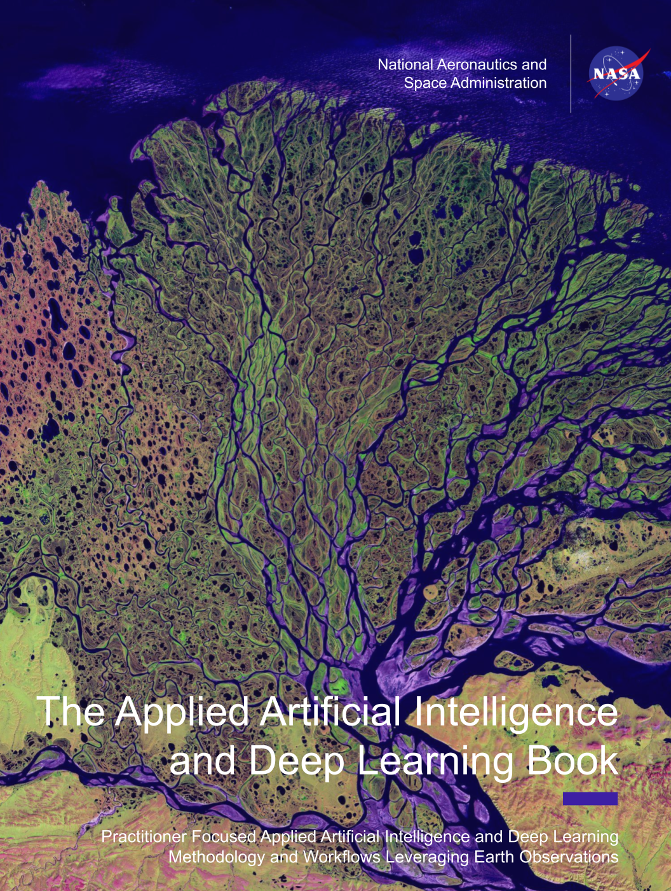

# EarthRISE Applied Artificial Intelligence and Deep Learning Book

<!--  -->

<!-- # -->

  

The NASA EarthRISE program harnesses NASA Earth Action capabilities to deliver trusted solutions for sustained benefits to society. Collabroting with State and Local partners and striving to strengthens the capacities of partners to use satellite data and geospatial technology to address critical challenges. EarthRISE co-develops innovative solutions through a network of partners to improve resilience and sustainable resource management across scales. Additionally, EarthRISE focuses on developing participate in innovative knowledge products such as the [SAR Handbook](https://servirglobal.net/resources/sar-handbook) and the [GEE book](https://www.eefabook.org/) designed to support capacity building in applying Remote Sensing and geospatial approaches to address challenges. 

The focus of the EarthRISE Applied Artificial Intelligence and Deep Learning Book is to provide practitioners with a wide variety of applied examples of Remote Sensing Artificial Intelligence and Deep Learning approaches. With each chapter focusing on a specific problem set such as object detection of downscaling using Deep Learning. Additionally, throughout the books chapters various examples are provided spanning the aforementioned NASA Earth Action thematic areas. Thereby providing a wide variety of thematic applications to complement reader’s domain specific practical knowledge such as agronomy or forestry etc. 

We suspect readers are coming to this virtual book with preexisting geospatial expertise. However, limited Artificial Intelligence and Deep Learning knowledge

Each chapter contains both the theoretical background as well as a practical hand-on section facilitated through virtual notebooks. Finally, this book spans a variety of platforms such as TensorFlow and PyTorch to provide readers with a wide set of examples.

## Applied Deep Learning Book Outline

* [Introduction](https://github.com/SERVIR/SERVIR-Applied-Deep-Learning-Book/tree/main/01_Introduction)
* [Data Preparation](https://github.com/NASA-EarthRISE/EarthRISE-Applied-Artificial-Intelligence-and-Deep-Learning-Book/tree/main/02-Data-Preparation)
* [Semantic Segmentation](https://github.com/NASA-EarthRISE/EarthRISE-Applied-Artificial-Intelligence-and-Deep-Learning-Book/tree/main/03_Semantic_Segmentation)
  * [Crop Type Modeling](https://github.com/NASA-EarthRISE/EarthRISE-Applied-Artificial-Intelligence-and-Deep-Learning-Book/tree/main/03_Semantic_Segmentation/01__Crop_Mapping)
* [Object Detection](https://github.com/NASA-EarthRISE/EarthRISE-Applied-Artificial-Intelligence-and-Deep-Learning-Book/tree/main/04_Object_Detection)
* [Ecological Processes Simulation](https://github.com/NASA-EarthRISE/EarthRISE-Applied-Artificial-Intelligence-and-Deep-Learning-Book/tree/main/06_Eco_Process_Sim)
* [Transfer Learning](https://github.com/NASA-EarthRISE/EarthRISE-Applied-Artificial-Intelligence-and-Deep-Learning-Book/tree/main/07_Transfer_Learning)
* [Fusion](https://github.com/NASA-EarthRISE/EarthRISE-Applied-Artificial-Intelligence-and-Deep-Learning-Book/tree/main/08_Fusion)
* [Downscaling](https://github.com/NASA-EarthRISE/EarthRISE-Applied-Artificial-Intelligence-and-Deep-Learning-Book/tree/main/09_Downscaling)
* [Future of Deep Learning and Foundational Models](https://github.com/NASA-EarthRISE/EarthRISE-Applied-Artificial-Intelligence-and-Deep-Learning-Book/tree/main/10_Future)
* [Ethics of Artificial Intelligence](https://github.com/NASA-EarthRISE/EarthRISE-Applied-Artificial-Intelligence-and-Deep-Learning-Book/tree/main/11_Ethics)
* [Conclusions](https://github.com/NASA-EarthRISE/EarthRISE-Applied-Artificial-Intelligence-and-Deep-Learning-Book/tree/main/12_Conclusions)

## License and Distribution

SERVIR-Applied-Deep-Learning-Book is distributed by SERVIR under the terms of the MIT License. See
[LICENSE](https://github.com/SERVIR/SERVIR-Applied-Deep-Learning-Book/blob/main/LICENSE) in this directory for more information.

## Privacy & Terms of Use

EarthRISE Applied Artificial Intelligence and Deep Learning Book abides to all of EarthRISE's privacy and terms of use
